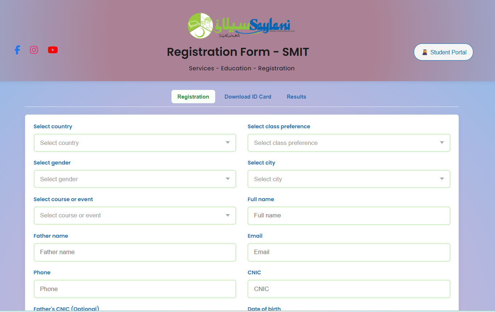

# SMIT Registration Form Clone

A responsive registration form created using **HTML**, **CSS**, and a bit of **JavaScript** for tab navigation.  
This project replicates the Saylani Mass IT Training registration form layout.

## 🔧 Technologies Used
- HTML5  
- CSS3 (Flexbox & Grid for responsive layout)  
- JavaScript (for tab switching)

## 🌟 Features
- Fully responsive design for mobile and desktop  
- Header with social media icons and navigation tabs  
- Styled input fields with hover & focus effects  
- Clean color scheme and organized layout

## 📸 Preview
 

## 🧠 Learning Outcome
Practiced form styling, responsive design, and JS interactivity while cloning the SMIT registration form.

---
⭐ *Created as part of my Saylani training journey while improving frontend development skills.*
## 🙏 Acknowledgment
Special thanks to **Sir Muhammad Ahad** and **Saylani Mass IT Training Program** for their guidance and learning platform.
